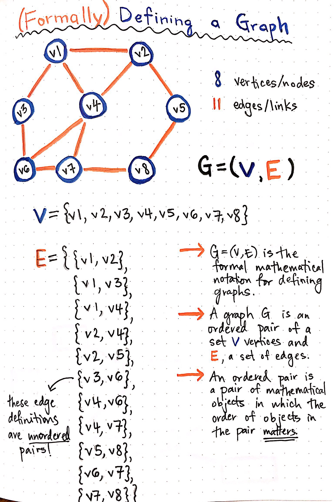

# Intro to Graph Theory

## What are graphs?
Graphs are a way to formally represent a network, a collection of interconnected objects.

Formal definition: G = (V, E)

A graph is an ordered pair of two objects:
1. A set a vertices
2. A set of edges

An edge is uniquely identified by its two endpoints. Edges can be directed (one way), or undirected (two way).

For directed graphs (digraphs) vs undirected graphs. Both graphs have the same properties for vertices. Directed graphs have ordered pairs of edges, undirected graphs have unordered pairs of edges. Directed graphs have ordered pairs because travel is only permitted from the origin to the destination, reverse travel is not possible.

## Applications of Graphs
  + Social Networks
    + Facebook (undirected)
    + Twitter (directed)
  + World Wide Web (directed)
  + Road systems (directed)

Web Crawling is an example of Graph Traversal

## Weighted vs Unweighted edges
Weighted graphs: Each edge has a cost associated with it (example highways have the length of the road)
Unweighted graphs: A weighted graph where every edge has an equal weight.

## Properties of Graphs
  |V| => number of vertices
  |E| => number of edges

+ Self-Loop (Self Edge): An edge where both the vertices are the same. Can be directed or undirected.
  Example: A webpage linking to itself
+ Multi Edge (Parallel edge): An edge that occurs more than once in a graph. Can be directed or undirected
  Example: Weighted graphs with parallel edges of different weight
+ Simple Graph: an graph that has no self-loops or parallel edges.
+ min edges in a simple graph = 0
+ max edges in a simple graph (undirected) = [ V * (V-1) ] / 2
+ max edges in a simple graph (directed) = [ V * (V-1) ]

Dense => |E| approaching max edges
Sparse => |E| approaching min edges

Sparse graphs tend to use an adjacency matrix
Dense graphs tend to use an adjacency list

## Paths
Walk: A sequence of vertices where each adjacent pair is connected by an edge
  + Example: { A, B, F, H } = A -> B -> F -> H
  + Edges must be aligned for directed graphs
Simple Path: a walk in which there are no repeated edges or vertices
Trail: vertices can be repeated, edges cannot be repeated

A path generally refers to a simple path.
If a walk is possible between two different vertices, there must exist a simple path is also possible between those vertices.

connected: A graph that where there is a path between every pair of vertices
strongly connected: There is a path form every vertex to every other vertex
weakly connected: A directed graph that is not strongly connected, but it would be if it were converted into an undirected graph.

Closed walk. A walk that starts and ends on the same vertex.
Simple walk: A walk with no repetition except for the start/end.
Acyclic graph: a graph with no cycle

trees are undirected acyclic graphs.

Directed acyclic graph (DAG)

## Source
[A Gentle Introduction to Graph Theory](https://medium.com/basecs/a-gentle-introduction-to-graph-theory-77969829ead8) By Vaidehi Joshi

[Data Structures: Introduction to graphs](https://www.youtube.com/watch?v=gXgEDyodOJU) By mycodeschool
[Property of Graphs](https://www.youtube.com/watch?v=AfYqN3fGapc) By mycodeschool
