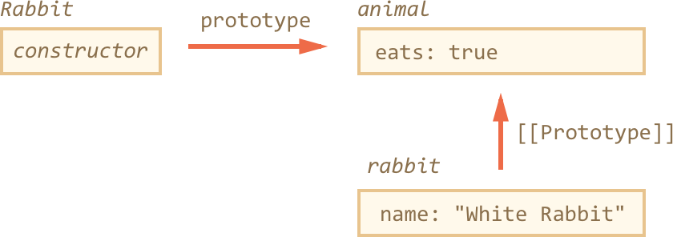

# Prototype
+ Objects default to having a prototype property with the value of object
+ The new operator sets the prototype property of the created object to whatever the created object is being created as a new instance of.
+ F.prototype is not the same as [[Prototype]]
+ F.prototype sets [[Prototype]] when new F() is called
+ F.prototype is always an object or null
+ prototype property only has special effect when it is set to a constructor function

The `new` constructor creates a new object.
  - when an object `new F()` is created that objects' [[Prototype]] is set to F.prototype
  - if `F` has a `prototype` property with the object type, then when the `new` operator is invoked, the `prototype` property is used to set the [[Prototype]] of the new object.

Setting a constructor's prototype means that all objects created with the constructor will have the prototype we set. Ex

```
let animal = {
  eats: true
};
function Rabbit(name){
  this.name = name;
}

Rabbit.prototype = animal;

let rabbit = new Rabbit("White Rabbit");

console.log(rabbit.eats) // true
```

`Rabbit.prototype = animal;` means that when we create new Rabbits, their [[Prototype]] will be set to animal.



"prototype" is a horizontal arrow, it's a regular property
[[Prototype]] is a vertical arrow, it means that rabbit inherits from animal.

Every function has the "prototype" property. The default "prototype" property is an object with the property constructor. The constructor property points back to the function to which constructor belongs.

If we re-write the prototype we can overwrite the constructor property. To avoid this we can just add new properties to the constructor object like this: `Rabbit.prototype.jumps = true`

[More resources](https://javascript.info/function-prototype)
